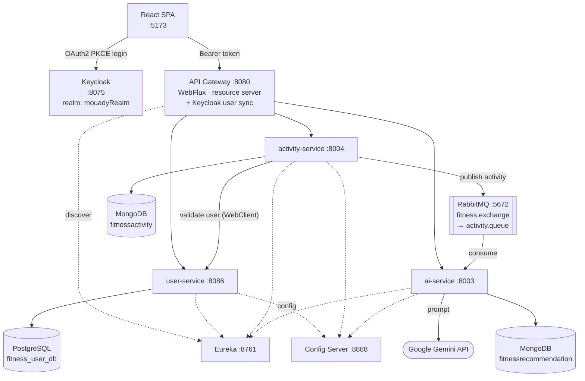
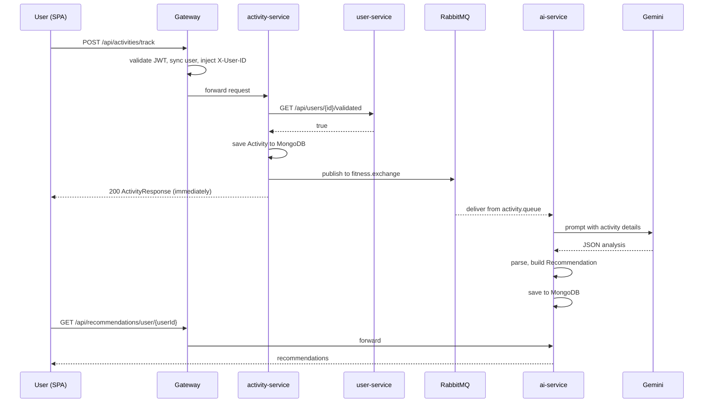

# Fitness Go

A fitness tracking platform that turns logged workouts into AI coaching. You record an activity, the platform stores it, and an AI service picks it up asynchronously and writes back a personalised analysis — improvements, suggestions, and safety notes generated by Google Gemini.

Built as Spring Boot microservices behind a WebFlux gateway, with **Keycloak** for identity, **RabbitMQ** for the AI handoff, and a **React 19** single-page app on top.

---

## Table of contents

- [Architecture](#architecture)
- [Services](#services)
- [Tech stack](#tech-stack)
- [How a workout becomes a recommendation](#how-a-workout-becomes-a-recommendation)
- [Authentication](#authentication)
- [Running it](#running-it)
- [API reference](#api-reference)
- [Project layout](#project-layout)
- [Configuration](#configuration)
- [Notes and known rough edges](#notes-and-known-rough-edges)

---

## Architecture



The gateway is the only entry point. Writing an activity returns immediately — the AI work happens off the request path, over a queue, so a slow model call never blocks the user.

## Services

| Module | Port | Storage | Responsibility |
| --- | --- | --- | --- |
| **eureka** | 8761 | — | Service registry |
| **configserver** | 8888 | — | Centralised config, `native` profile from `classpath:/config` |
| **gateway** | 8080 | — | Routing, JWT validation against Keycloak, auto-provisioning users |
| **userservice** | 8086 | PostgreSQL | User profiles, registration, existence checks |
| **activityservice** | 8004 | MongoDB | Records workouts, publishes them for AI processing |
| **ai** | 8003 | MongoDB | Consumes activities, calls Gemini, stores recommendations |
| **fitness-app-frontend** | 5173 | — | React SPA |

## Tech stack

| Concern | Choice |
| --- | --- |
| Language / build | Java 21, Maven (one independent project per module) |
| Framework | Spring Boot (3.3.x and 4.0.x — see [rough edges](#notes-and-known-rough-edges)) |
| Discovery / config | Eureka, Spring Cloud Config (native/filesystem) |
| Gateway | Spring Cloud Gateway (WebFlux) |
| Identity | Keycloak, OAuth2 Resource Server, Authorization Code + PKCE |
| Messaging | RabbitMQ (direct exchange, JSON converter) |
| Databases | PostgreSQL (users), MongoDB (activities, recommendations) |
| AI | Google Gemini via `WebClient` |
| Frontend | React 19, Vite, Material UI 9, Redux Toolkit, React Router 7, Axios |

## How a workout becomes a recommendation



The AI service asks Gemini for a **strict JSON shape**, then strips the ```` ```json ```` fences the model wraps around it and parses out the analysis, improvements, suggestions, and safety notes into a `Recommendation` document.

**Tracked activity types:** `RUNNING`, `WALKING`, `CYCLING`, `SWIMMING`, `YOGA`, `FOOTBALL`. Each activity carries duration, calories burned, start time, and a free-form `additionalMetrics` map, so activity-specific data (heart rate, distance, pace) can be attached without a schema change.

## Authentication

Identity lives entirely in Keycloak — the services never handle passwords for login.

1. The SPA runs the **Authorization Code + PKCE** flow against realm `mouadyRealm`, client `mouady-1`, on `http://localhost:8075`.
2. The gateway is an **OAuth2 resource server**, validating tokens against Keycloak's JWK set. Everything except `/actuator/**` requires authentication.
3. `KeycloakUserSyncFilter` reads the token claims (`sub`, `email`, `given_name`, `family_name`) and, the first time it sees a user, **auto-registers them** in `user-service`. No manual signup step exists.
4. The filter then injects **`X-User-ID`** into the forwarded request, which is what `activity-service` reads to scope data to the caller.

## Running it

### Prerequisites

- **Java 21+**
- **Maven** (or the bundled `mvnw` in each module)
- **Node.js 20.19+** (Vite 8)
- **PostgreSQL**, **MongoDB**, **RabbitMQ**, **Keycloak**

### 1. Backing services

Convenient one-liners if you don't already have them running:

```bash
docker run -d --name fitness-postgres -p 5432:5432 \
  -e POSTGRES_PASSWORD=00000 -e POSTGRES_DB=fitness_user_db postgres:16

docker run -d --name fitness-mongo -p 27017:27017 mongo:7

docker run -d --name fitness-rabbit -p 5672:5672 -p 15672:15672 rabbitmq:3-management

docker run -d --name fitness-keycloak -p 8075:8080 \
  -e KEYCLOAK_ADMIN=admin -e KEYCLOAK_ADMIN_PASSWORD=admin \
  quay.io/keycloak/keycloak:26.0 start-dev
```

In the Keycloak admin console create a realm named **`mouadyRealm`** and a public client **`mouady-1`** with redirect URI `http://localhost:5173/` and Standard Flow + PKCE enabled.

### 2. Gemini API key

The AI service reads two values, both supplied from the environment:

```bash
export GEMINI_API_URL="https://generativelanguage.googleapis.com/v1beta/models/gemini-2.0-flash:generateContent?key="
export GEMINI_API_KEY="<your key>"
```

> Note the URL ends with `?key=` — `GeminiService` concatenates the key onto the URL directly.

### 3. Backend, in order

Discovery and config must come up first:

```bash
cd eureka        && ./mvnw spring-boot:run   # → http://localhost:8761
cd configserver  && ./mvnw spring-boot:run   # → http://localhost:8888
cd gateway       && ./mvnw spring-boot:run   # → http://localhost:8080
cd userservice   && ./mvnw spring-boot:run   # → :8086
cd activityservice && ./mvnw spring-boot:run # → :8004
cd ai            && ./mvnw spring-boot:run   # → :8003
```

Each module is an independent Maven project — there is no aggregator POM, so build and run them individually.

### 4. Frontend

```bash
cd fitness-app-frontend
npm install
npm run dev        # → http://localhost:5173
```

## API reference

All calls go through the gateway on **:8080** and require `Authorization: Bearer <keycloak-token>`.

### Activities

| Method | Endpoint | Notes |
| --- | --- | --- |
| `POST` | `/api/activities/track` | Record an activity; triggers async AI processing |
| `GET` | `/api/activities/` | Activities for the caller (reads the `X-USER-ID` header) |
| `GET` | `/api/activities/{activityId}` | A single activity |

```json
// POST /api/activities/track
{
  "userId": "b3f1...",
  "type": "RUNNING",
  "duration": 45,
  "caloriesBurned": 420,
  "startTime": "2026-09-27T07:30:00",
  "additionalMetrics": { "distanceKm": 8.2, "avgHeartRate": 148 }
}
```

### Recommendations

| Method | Endpoint | Notes |
| --- | --- | --- |
| `GET` | `/api/recommendations/user/{userId}` | All AI recommendations for a user |
| `GET` | `/api/recommendations/activity/{activityId}` | The recommendation for one activity |

### Users

| Method | Endpoint | Notes |
| --- | --- | --- |
| `GET` | `/api/users/{userId}` | Profile |
| `GET` | `/api/users/{userId}/validated` | Existence check used by activity-service |
| `GET` | `/api/users/all-users` | All users |
| `POST` | `/api/users/register` | Registration — normally called by the gateway's sync filter, not directly |

## Project layout

```
.
├── eureka/                     # service registry
├── configserver/
│   └── src/main/resources/config/
│       ├── user-service.properties
│       ├── activity-service.properties
│       ├── ai-service.properties
│       └── gateway.yml         # config served to every service
├── gateway/
│   ├── SecurityConfig.java         # resource server, JWK validation
│   ├── KeycloakUserSyncFilter.java # auto-provision + X-User-ID injection
│   └── user/                       # WebClient to user-service
├── userservice/                # JPA + PostgreSQL
├── activityservice/
│   ├── service/ActivityService.java        # save + publish
│   ├── service/UserValidationService.java  # WebClient to user-service
│   └── config/RabbitMqConfig.java          # exchange, queue, binding
├── ai/
│   ├── service/ActivityMessageListener.java # @RabbitListener
│   ├── service/ActivityAiService.java       # prompt + response parsing
│   └── service/GeminiService.java           # Gemini HTTP call
└── fitness-app-frontend/
    ├── src/authConfig.js       # Keycloak PKCE config
    ├── src/store/              # Redux Toolkit auth slice
    ├── src/componenets/        # ActivityForm, ActivityList, ActivityDetail
    └── src/services/api.js     # Axios client
```

## Configuration

`configserver` runs with the **`native`** profile and serves the files under `src/main/resources/config/`, so configuration is versioned in this repo rather than pulled from a separate Git repository. `userservice`, `activityservice` and `ai` each keep only an application name plus `spring.config.import=optional:configserver:http://localhost:8888`.

| Setting | Where | Value |
| --- | --- | --- |
| RabbitMQ exchange | `activity-service.properties`, `ai-service.properties` | `fitness.exchange` |
| RabbitMQ queue | same | `activity.queue` |
| Postgres database | `user-service.properties` | `fitness_user_db` |
| Mongo databases | activity / ai | `fitnessactivity`, `fitnessrecommendation` |
| Keycloak JWK set | `gateway/application.yml` | `http://localhost:8075/realms/mouadyRealm/...` |
| Gemini URL + key | environment | `GEMINI_API_URL`, `GEMINI_API_KEY` |

The committed local passwords (`postgres` / `00000`, RabbitMQ `guest` / `guest`) are development defaults. Override them with environment variables for anything beyond a local machine. The Gemini key is correctly kept out of the repo as an environment placeholder.

## Notes and known rough edges

- **Gemini is called twice per activity.** `ActivityAiService.generateRecommendation` calls `processAiResponse` twice and discards the first result, and `ActivityMessageListener.processActivity` calls `generateRecommendation` again after the `try` block. That is up to four model calls where one would do, and only the last result is saved. Worth fixing first — it is the main cost and latency issue.
- **`safetySuggestions` duplicates `suggestions`.** Both read `analysisJson.path("suggestions").path("description")`, so the safety field never contains safety data.
- **`Thread.sleep(4000)` in the Rabbit listener** throttles the consumer by blocking its thread. A concurrency or rate-limit setting would be the right mechanism.
- **Gateway route mismatch.** `gateway/src/main/resources/application.yml` routes the AI service at `/api/recommendations/**`, while the config server's `gateway.yml` routes it at `/api/ai/**`. Since the config server wins at runtime, check which prefix is actually live.
- **Spring Boot versions drift across modules** — `activityservice` 3.3.4 and `userservice` 3.3.5 against `ai`/`configserver` 4.0.5, `gateway` 4.0.6, with correspondingly split Spring Cloud versions (2023.0.3 vs 2025.1.1). Aligning them (ideally under one parent POM) would remove a class of surprises.
- **A hardcoded placeholder password** (`user1@23`) is assigned to every auto-provisioned user in `KeycloakUserSyncFilter`. Harmless only because Keycloak owns real authentication; the column should be nullable instead.
- **`RuntimeException` for domain failures.** Unknown users and missing activities throw raw `RuntimeException`, surfacing as `500`s rather than `404`/`400`. A `@ControllerAdvice` with typed exceptions would fix the status codes.
- **Stray imports** — `org.apache.catalina.User` in `UserController` and `javax.management.RuntimeErrorException` in `ActivityService` are unused and should go.
- **`componenets/`** is a typo for `components/` in the frontend.
- **No aggregator POM and no compose file**, so bringing the stack up is six manual commands plus four backing services.
